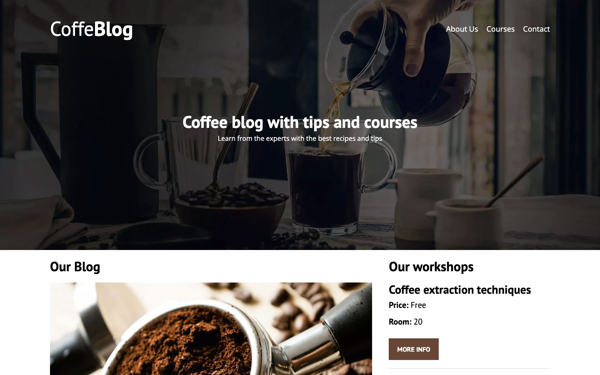
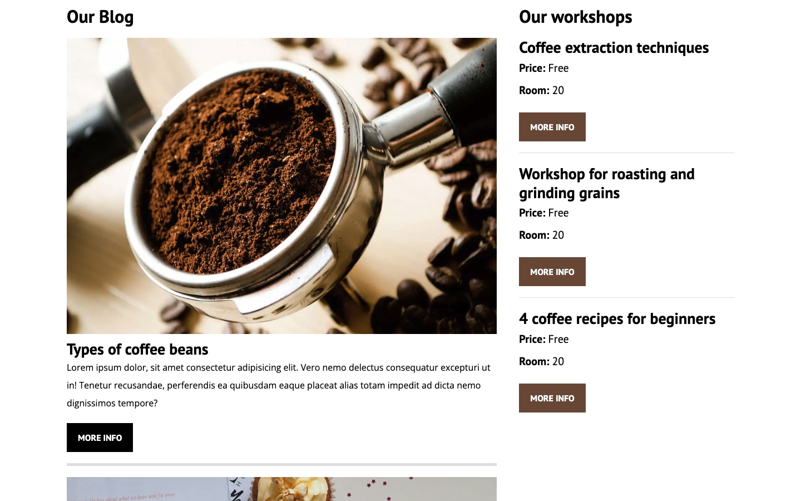
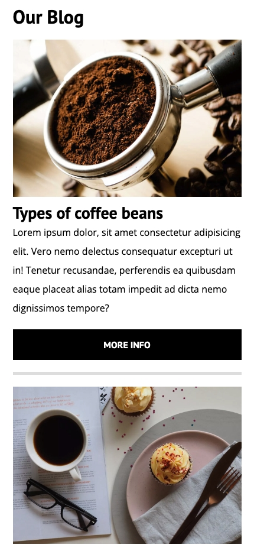
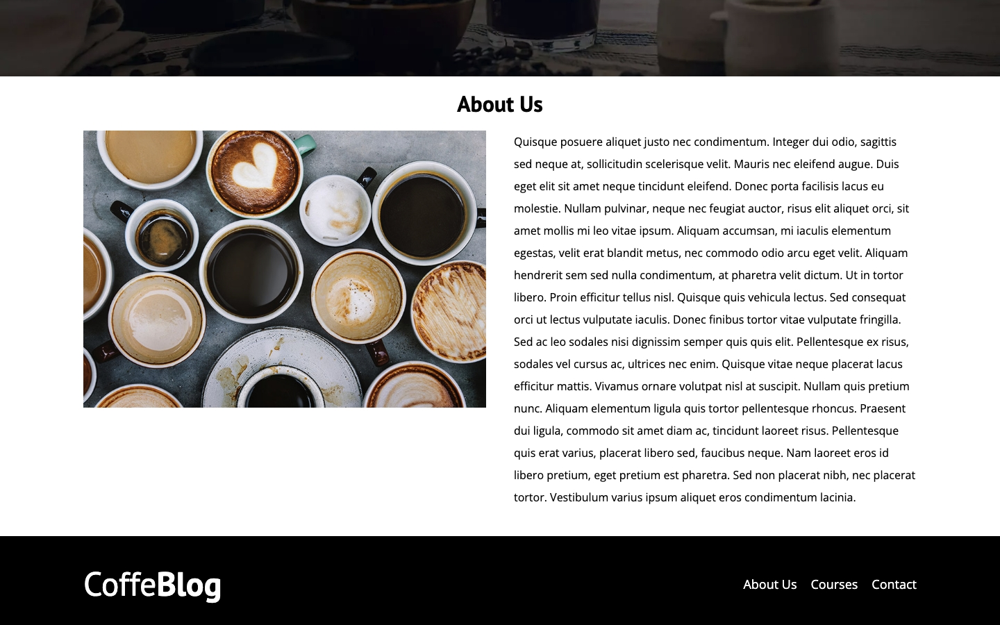
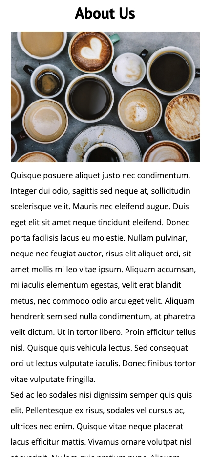
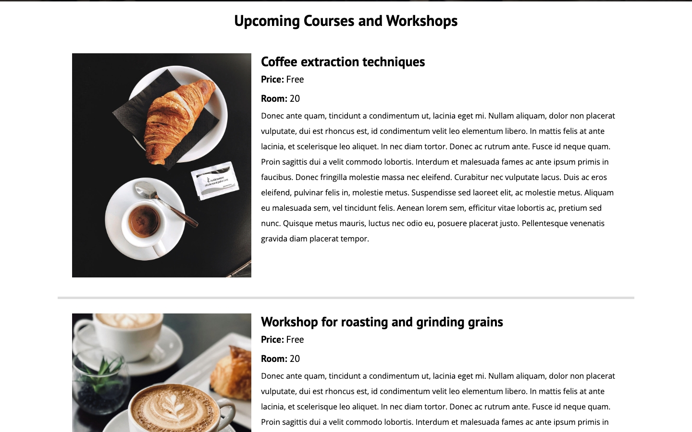
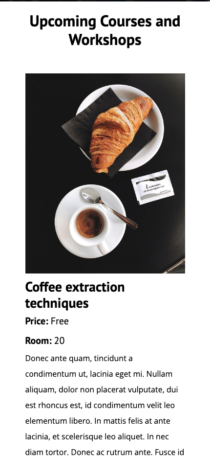
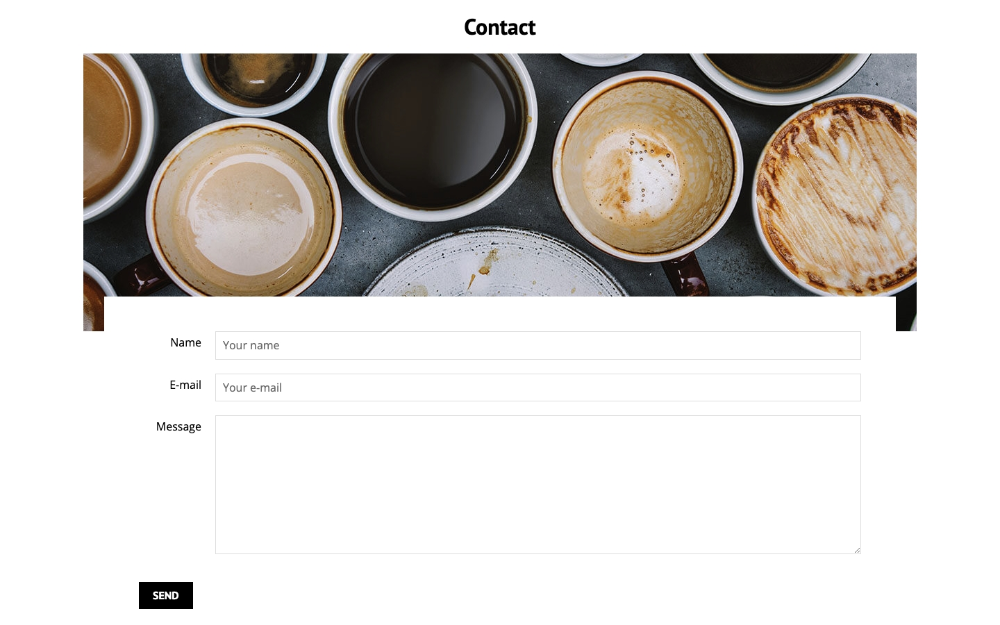
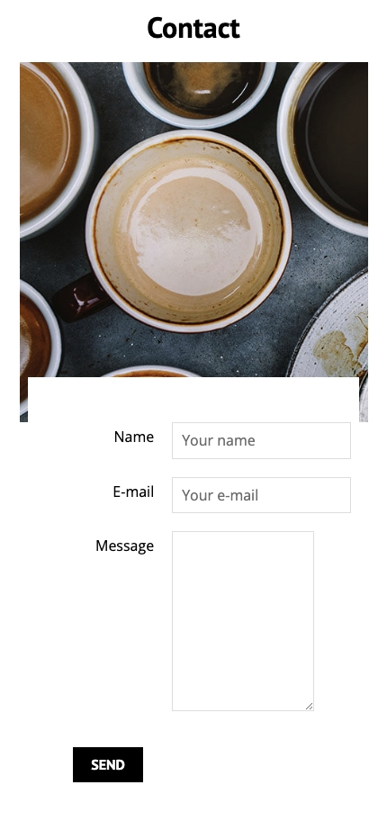

# CoffeBlog

CoffeBlog is a website dedicated to coffee enthusiasts. Here you will find delicious recipes, information about the benefits of coffee, and you can join our workshops to learn coffee extraction and roasting techniques. This project was created as a practice in web design and programming. The main objective is to apply modern techniques such as CSS Grid and Flexbox to develop a responsive and visually appealing design. Through this project, I aimed to enhance my skills in developing user interfaces that adapt optimally to a variety of devices and resolutions.

## Features

- **Home Page**
The main landing page that welcomes users and provides an overview of what CoffeBlog offers.
The website includes a welcoming homepage with a header that links to the site information and contact pages. It also features a footer that complements and maintains the overall style. There is a vertical view displaying various blog entries and a sidebar showcasing the different workshops offered, along with their key details. The website maintains a consistent style across all its pages.

    

        
    

    

        
    

    

        
    

    

        
    

- **About us**
Information about our mission, vision and the team behind CoffeBlog.
This page is dedicated to explaining the purpose of the website. Keeping a consistent HTML style across all pages and using Lorem Ipsum to fill the text, as is common in practice projects.

    

        
    

    

        
    

- **Courses Page**
Join our free workshops to learn coffee extraction, roasting, and grinding techniques.
Area used to display the workshops offered. Use a list of all items with their representative pictures, details about price and location, and a brief description.

    

        
    

    

        
    

- **Contact Page**
Get in touch with us for any inquiries, feedback, or support.
The contact page features a useful form for providing feedback. It includes a dedicated image, and the form is styled to overlay the image, creating an appealing visual effect for the user.

    

        
    

    

        
    

## Technologies Used

- **HTML5 & CSS3**: For structuring and styling the web pages.
- **Lorem Ipsum**: Used to fill the text in practice projects for placeholder content.
- **JavaScript**: To add interactivity and dynamic content.
- **Modernizr**: To detect HTML5 and CSS3 features in various browsers.
- **Flexbox**: For creating flexible and responsive layouts.
- **Responsive Design**: Ensuring the website looks great on all devices, from desktops to mobile phones.

## Lessons Learned

Through this project, I have significantly improved my skills in designing websites using only HTML and CSS. This practice allowed me to focus on creating a fast and smooth user experience without relying on external libraries or frameworks. Additionally, I learned to develop responsive web designs that adapt perfectly to any device, ensuring an optimal experience on both desktop and mobile.

## License

This project is licensed under the MIT License. See the `LICENSE` file for more details.
